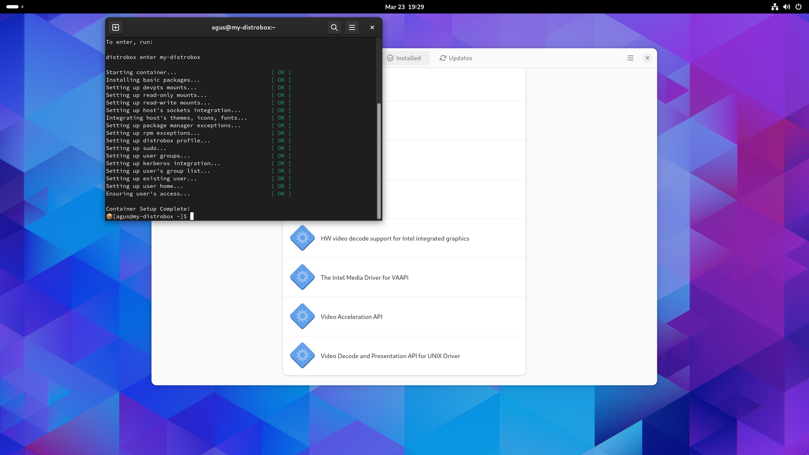

[BlueFusion][1]
===============

A Fedora Silverblue image that adds RPM Fusion with media codecs and replaces
[Toolbox][2] with [Distrobox][3].

<picture>
  <source media="(prefers-color-scheme: light)" srcset="screenshot-light.png">
  <source media="(prefers-color-scheme: dark)"  srcset="screenshot-dark.png">
  
</picture>

Usage
-----

1. Rebase to an unsigned image to get proper signing keys:

       rpm-ostree rebase ostree-unverified-registry:ghcr.io/aguslr/bluefusion:latest && systemctl reboot

2. Rebase to a signed image to finish the installation:

       rpm-ostree rebase ostree-image-signed:docker://ghcr.io/aguslr/bluefusion:latest && systemctl reboot

Alternatively, an [ISO file for offline installation][8] can be generated with
the following command:

    sudo podman run --rm --privileged \
        --volume .:/build-container-installer/build \
        --security-opt label=disable --pull=newer \
        ghcr.io/jasonn3/build-container-installer:latest \
        IMAGE_REPO="ghcr.io/aguslr" \
        IMAGE_NAME="bluefusion" \
        IMAGE_TAG="latest" \
        VARIANT="Silverblue"

Features
--------

- Start with a custom Fedora Silverblue image.
- Install [HomeBrew][9].
- Replace `toolbox` with `distrobox`.
- Add RPM Fusion repositories and several multimedia packages.
- Set automatic checking of updates for the system.
- Add keyboard shortcuts:
  + Open Terminal into the system's shell: `<Control><Alt>t`
  + Open Terminal into the default Distrobox container: `<Super>Return`

Verification
------------

These images are signed with Sisgstore's [Cosign][4]. You can verify the
signature by downloading the `cosign.pub` key from this repo and running the
following command:

    cosign verify --key cosign.pub ghcr.io/aguslr/bluefusion

References
----------

- [Building your own custom Fedora Silverblue image][5]
- [Howto/OSTree - RPM Fusion][6]
- [Cosign - Sigstore Documentation][4]
- [Making your Own - Universal Blue][7]
- [feat: homebrew on image by m2Giles · Pull Request #1128 · ublue-os/bazzite ·
  GitHub][10]
- [Homebrew's path setting conflict with host binaries · Issue #687 ·
  ublue-os/bluefin · GitHub][11]

[1]:  https://github.com/aguslr/bluefusion
[2]:  https://github.com/containers/toolbox
[3]:  https://github.com/89luca89/distrobox
[4]:  https://docs.sigstore.dev/cosign/overview/
[5]:  https://www.ypsidanger.com/building-your-own-fedora-silverblue-image/
[6]:  https://rpmfusion.org/Howto/OSTree
[7]:  https://ublue.it/making-your-own/
[8]:  https://blue-build.org/learn/universal-blue/#fresh-install-from-an-iso
[9]:  https://brew.sh/
[10]: https://github.com/ublue-os/bazzite/pull/1128/commits/2dbf297
[11]: https://github.com/ublue-os/bluefin/issues/687
